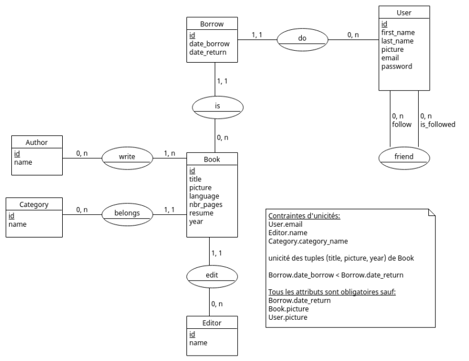

# S4.A.01-E2-Bibliothèque

## Summary

* [Introduction](#introduction)
  * [Context](#context)
  * [Objectives](#objectives)
* [Installation](#installation)
    * [Deploy database](#deploy-database)
    * [Deploy API](#deploy-api)
    * [Deploy website](#deploy-website)
* [SGBD used](#sgbd-used)
* [Setup Dev](#setup-dev)
* [Dev Standards](#dev-standards)
* [Contributors](#contributors)

## Introduction

### Context
This project is part of the 4th semester of BUT2 Informatique at the IUT of Bordeaux, supervised by Mr Guibert, Mr Journet, Mr Fossé, Mr Lamoureux, Mr Félix, Mr Passault and Mr Ramet.

We had 1 week and a half to carry out this project in a group of 5 students, to submit it on March 31, 2023.

### Objectives
The instructions for this mini-project consisted of creating a library database, then making an API to retrieve data from the database, then creating a website using the API.

The result to be provided is therefore a database in MySQL, APIs made in Symfony, and a website in React.

## Installation

### Deploy database

```bash
...
```

### Deploy API

```bash
cd ApiLibrary
composer install
```

### Deploy website

```bash
cd frontlibrary
npm install
npm start
```

## SGBD used

- mySQL

### Entity-relationship model



## Setup Dev

Here are the requirements for setting up the development enironment:

- Symfony
- php cs fixer (v0.3.9)
- Symfony VSCode extension (v1.0.2)
- Prettier VSCode extension (v9.10.3)
- Intelephense VSCode extension (v1.9.3)
- Conventional Commits VSCode extension (v1.25.0)

## Dev Standards

- Class name use PascalCase rules
- Function name use camelCase rules
- Variable use snake_case rules
- Use audit
- PHP linter : PSR12
- Tools to verify norms : Intelephense, Prettier, php cs fixer
- Pipeline

## Contributors
- Maud Genetet : Manager and DevOps
- Felix Von Euw : Front-end
- Pauline Cerello : Front-end
- Benjamin Loupiac : Back-end and Database
- Younes El Mesaoudi Maftah : Back-end
